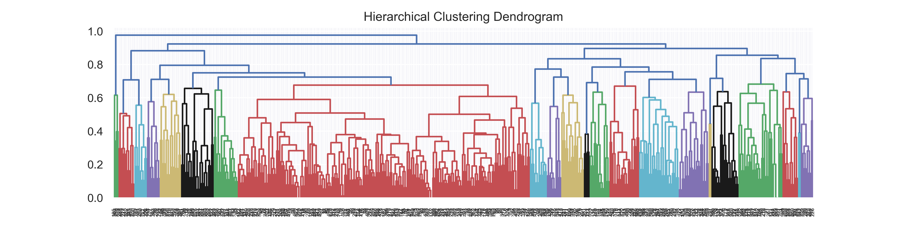
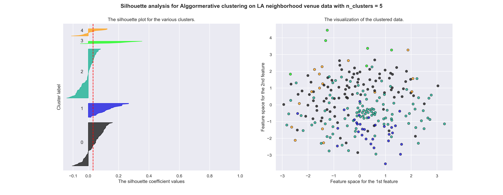

```{r, echo=FALSE, results='hide', eval=FALSE}
library(checkpoint)
checkpoint('2020-02-10')

```


### 1. Introduction

#### 1.1 Business Problem: Searching for a New home in a New City

According to the [US Census Bureau](https://www.census.gov/data/tables/time-series/demo/geographic-mobility/historic.html), every year approximately 32 Million Americans move home. Moving to a new city is a difficult undertaking and can result in a lot of stress. Especially when you like the facilities and venues in your current accommodation. There may be many different locations in a vast number of neighborhoods to choose from. 

Albert Einstein famously worked on three rules, ["Out of clutter, find simplicity. From discord, find harmony. In the middle of difficulty, lies opportunity."](http://www.bigear.org/vol1no4/wheeler.htm). The difficulty faced by the huge number of people moving home annually and real-estate and rental industries make up the target audience of stakeholders who face this problem. Simplifying the search for new accommodation in a new city has real value for people moving home by reducing the cognitive load and accompanying stress. Having a way to contextualize real-estate / rental listings based on a users current location would give a real-estate company a competitive advantage. These reasons explain why people moving to a new city and real-estate / rental-listing companies care about simplifying the problem of search for a new home in an new city.

#### 1.2 Solution: Contextualize the Unfamiliar City

To make moving home easier, you need a reference point, where potential neighborhoods in the new city are compared to your current location. Imagine a real-estate / rental-listing website (such as [zillow](https://www.zillow.com/) or [realtor](https://www.realtor.com/) being able to contextualize the potential neighborhoods based on their similarity of surrounding facilities to your current accommodation. To do this, the user's current city's neighborhoods would be clustered. These clusters would then be used as class labels, for training a classification algorithm. This classifier would then assign neighborhoods in the new city to be like neighborhood clusters in the current city. This would provide the user with a common reference point to filter their options, reducing the cognitive demand of selecting a new home.

As a proof of concept case study, Los Angeles (USA) is selected as the current city and New York City (USA) is selected as the moving location. Then a three-step process is applied with the aim to make unfamiliar New York understandable by relating the neighborhoods to Los Angeles:

 1. The neighborhoods of Los Angeles will be clustered based on their surrounding facilities.
 2. These clusters will be used as labels to train a classifier.
 3. The classifier will then be applied to New York City neighborhoods, providing context for the new city via analogy to the current residence.


### 2. Data

#### 2.1 Sources

Neighborhood names and boundaries, as defined by the latitude, longitude coordinates of bounding polygons of the will be sourced from [Neighborhood Data for Social Change](https://usc.data.socrata.com/dataset/Los-Angeles-Neighborhood-Map/r8qd-yxsr) for Los Angeles and [New York Open Data](https://data.cityofnewyork.us/City-Government/Neighborhood-Tabulation-Areas-NTA-/cpf4-rkhq) for New York City. To simplify what venues are considered to be within a neighborhood, the [centroid of the bounding polygon](https://en.wikipedia.org/wiki/Centroid#Of_a_polygon) will be calculated. Venues will be considered as part of the neighborhood if they fall within 1000 meter radius of the centroid of each neighborhood polygon (see data exploration for update).

The types of venues (categories) of the surrounding businesses and facilities in each neighborhood will be sourced from the [Foursquare Places API](https://developer.foursquare.com/docs/api). The venue categories might not be distinct, for example cafes, coffee houses, and coffee bars should probably be considered the same type of venue. So the venue categories will be clustered based on their semantic meaning using a natural-language-processing word-embedding distance metric. 

Each category cluster will form a feature dimension for clustering and classification. For each neighborhood, the number of venues in each category cluster will be counted. Then each category cluster count will be divided by the total neighborhood venues. So, the features of each neighborhood are the venue category clusters as a proportion of the total venues within the neighborhood. 

The neighborhood proportion-venue vector, that sums to one, can be considered to fall with in a [simplex](https://en.wikipedia.org/wiki/Simplex). A simplex can be considered to be a generalization of the idea of a triangle to any number of dimensions. The neighborhood features fall within the space defined by the simplex. This complicates comparing neighborhoods because their feature vectors are not well described by Euclidean metrics as their space is non-Euclidean. Therefore, the [Hilbert simplex distance](https://arxiv.org/pdf/1704.00454.pdf) will be used as an appropriate distance metric for this data.


#### 2.2 Getting the data

The following maps demonstrate that the neighborhoods in each city are quite different. Los Angeles has much larger neighborhood areas compared to New York City, and has a quite a few very large neighborhoods. This is an important factor to consider when gathering the neighborhood facilities. Originally, it was planned to use a venue inclusion radius of 1000 meters for both cities. However,Given the difference in areas, the venue inclusion radius for Los Angeles is set to 1250 meters, whereas the inclusion radius for New York City is set to 500 meters. These values were determined with a box plot of the neighborhood areas in each city as shown in figure 1.


##### Map of Los Angeles Neighborhoods

```{r, echo=F}

htmltools::tags$iframe(title = "embedded map of LA", src = "./la_map_df.html", width=1000,height=800)
```

##### Map of New York City Neighborhoods
```{r, echo=F}

htmltools::tags$iframe(title = "embedded map of NY", src = "./ny_map_df.html", width=1000,height=900)
```

Given the neighborhood radius definitions, outlier Los Angeles neighborhoods were excluded from further analysis. The map below shows the excluded neighborhoods highlighted in red with centroids placed within each neighborhood.

##### Map of Los Angeles Neighborhood Centroids (outliers excluded)

```{r, echo=F}

htmltools::tags$iframe(title = "embedded map of LA Centroids", src = "./la_map_markers_js.html",width=1000, height=800)
```

##### Map of New York City Neighborhood Centroids (outliers excluded)

```{r, echo=F}

htmltools::tags$iframe(title = "embedded map of NY Centroids", src = "./ny_map_markers_js.html",width=1000, height=800)
```


### 3. Methodology 

#### 3.1 Feature Exploration and Engineering: Clustering Venue Categories via Natural Language Processing

The venue categories for all the surrounding venues, at each neighborhood in Los Angeles and New York City form the features for the clustering and classification. However, there is no guarantee that the categories are mutually exclusive. So exploration of their semantic similarity is needed to assess whether some categories need to be combined.

This presents its own challenge as there are over 400 categories to compare. In order to make this comparison more manageable, venue categories were converted into 100 dimensional vectors using the *word2vec* embedding trained on Wikipedia data (available [here](http://wikipedia2vec.s3.amazonaws.com/models/en/2018-04-20/enwiki_20180420_100d.txt.bz2)).

The venue categories were converted by first splitting them into lists of single words, then each word was converted to the vector. The vectors were summed together then divided by the total number of words in the category. This produced one 100 dimension vector per category (venue vector). 

The venue vectors distance matrix was calculated using the cosine distance metric. Subsequently the vectors were clustered with Agglomerative Hierarchical Clustering and visualized with a dendrogram in figure 2. The threshold of .1 was chosen, by visual inspection, below which all venues were manually inspected for semantic overlap. 55 categories were found to have some degree of overlap and were combined into 24 categories.

{width=1600px, height=400px}


After combination there were 464 venue categories. These were one-hot-encoded and summed together for each neighborhood. This formed a multinomial vector representing each neighborhood. These neighborhood vectors were converted into simplexes (vectors whose elements sum to one) using Dirichlet flat prior (adding one to each element then dividing by the vector by the sum of each row). This meant that each simplex represented an estimate of the proportion of venue categories surrounding each neighborhood.


#### 3.2 Unsupervised Learning and Exploration: Clustering Los Angeles Neighborhoods

The Los Angeles neighborhood simplexes had a distance matrix calculated using [hilbert simplex distance](https://arxiv.org/pdf/1704.00454.pdf), which is a metric designed for estimating distances within non-Euclidean simplex spaces. Then the distance matrix was used to cluster the neighborhoods with Agglomerative Hierarchical Clustering (full linkage) and was visualized with a dendrogram (figure 3).

{width=1600px, height=400px}

Two neighborhoods, *Universal City* and *San Marino* were identified as outliers, as they would form their own clusters. Subsequent investigation excluded these neighborhoods.

Subsequently Silhouette Plots with 2-dimensional embedding (using Multi-Dimensional Scaling) were used to explore the quality of the clustering, and average silhouette scores were also used as a clustering metric.


#### 3.3 Supervised Learning: Training classifiers on LA Clusters

Classifiers were trained to generalize the Los Angeles neighborhood cluster labels to New York City neighborhoods. The performance of Four types of classifiers were assessed:

- K Nearest Neighbors with 1-10 neighbors

- Support Vector Machines with radial bias function, linear, cubic, and sigmoid kernels

- Decision Trees with Gini metric

- Gaussian Process with Radial Bias function kernel

These classifiers were selected to provide a range of different approaches to classification. To measure the performance of the classifiers, the training data was divided using a stratified 4-fold cross validation procedure. This means that for each class, the data is split into four approximately partitions. One partition is used for testing performance and the rest were used for training. This was repeated four times so that each partition was used as a test set.

Two metrics of performance were selected: overall accuracy (total correct / total classified) and proficiency ( mutual information between cluster labels and predicted labels / entropy of cluster labels). Accuracy was selected due to ease of understanding, whereas proficiency was chosen as it is unaffected when there is unequal distribution of each class. Since the Los Angeles clusters are unequally distributed (class counts 103, 84, 30, 16, 7, 6), proficiency and confusion matrix inspection was used to select the best performing classifier. Proficiency values can range from 0 (poor performance) to 1 (perfect classification). The top two best classifiers were visualized using a confusion matrix plot.


#### 3.4 Classifying New York City Neighborhoods

The best performing classifier from training on LA Clusters was used determine New York City neighborhood classes. Given no ground truth is known for these data, the classification labels were analysed with silhouette scores, compared to direct agglomerative clustering and visualized with silhouette plots and 2-dimensional embedding via Multi-Dimensional Scaling.


### 4. Results

#### 4.1 Clustering LA Neighborhoods

The results of the silhouette scores indicated that 2 clusters gave the most consistent clusters (figures 4 - 12). However, the purpose of this project was to give people who are moving to a new city context for the unknown neighborhoods. Two clusters may not provide the enough granularity necessary for someone to get an intuitive understanding of the new cities neighborhoods via analogy to their current city. Given this consideration, between 4 and 8 clusters would be more useful for the goal of the project of providing simple context for the new city without exceeding people's [working memory capacity](https://en.wikipedia.org/wiki/The_Magical_Number_Seven,_Plus_or_Minus_Two).


{width=1600px, height=400px}

{width=1600px, height=400px}

{width=1600px, height=400px}

{width=1600px, height=400px}


{width=1600px, height=400px}

{width=1600px, height=400px}

{width=1600px, height=400px}

{width=1600px, height=400px}

{width=1600px, height=400px}

Within the modified range, the silhouette scores indicate that 6 clusters was the ideal number. Two of the 6 clusters had less than 10 examples in them, showing a limitation in the size of the data available. The Final clustering was visualized in a map and via 3-dimensional embedding using Multi-Dimensional Scaling (figure 13).

{width=1200px, height=900px}

##### Map of Los Angeles Neighborhood Clustering

```{r, echo=F}

htmltools::tags$iframe(title = "embedded map of NY", src = "./la_map_clustered.html",width=1000, height=800)
```


#### 4.2 Training Classifiers on LA Clusters

The results of the classifiers indicated that the support vector machine with radial bias function kernel (SVM) and the Gaussian process with radial bias function kernel (GP) were the best performing classifiers, both in terms of accuracy (71%, 70%) and proficiency (0.47, 0.41). While proficiency was higher for SVM compared to  GP, using an inferential statistical test, there was no credible difference between performance (median difference = 0.02 , 95% HDI = [-0.10 , 0.14] includes zero, see figure 14).


Further inspection of the confusion matrix plots for SVM and GP, showed that SVM failed to classify any members of 2 clusters correctly whereas GP did make correct classifications for all of the cluster labels (see figures 15 and 16). This provided the rationale for selecting the GP classier over the SVM.


#### 4.3 Classifying New York City Neighborhoods

New York Neighborhoods were classified using the Gaussian Process classifier with radial bias function kernel, trained on the Los Angeles Neighborhood Clustering. The classification results were compared to agglomerative clustering using Hilbert simplex distance with the same number of classes, and displayed using silhouette plots and 2 dimensional embedding transformed by Multi-Dimensional Scaling (figures 17 and 18).


Both the classification and the clustering grouped the vast majority of neighborhoods together (182 for classification and 183 for clustering). Additionally, while the classifier had six classes, it only labelled New York City neighborhoods with 4 of them.  Taken together, this indicated that in terms of neighborhood venues, New York city is more homogeneous than Los Angeles.

The similarity of performance of the classifier and the clustering indicates that the classifier is performing well.


##### Map of New York City Neighborhood Classification

```{r, echo=F}

htmltools::tags$iframe(title = "embedded map of NY", src = "./ny_map_clustered.html",width=1000, height=800)
```


### 4.4  Exploring the LA Clustering and NY Classified Neighborhoods

By looking at the top 10 venue categories we can get a feel for what the neighborhoods are like. All but cluster 1 are dominated by food establishments. The Clusters were named by their dominant venues:

 - Cluster 0: Pizza Place
 - Cluster 1: Park
 - Cluster 2: Mexican Restaurants
 - Cluster 3: Korean Restaurants
 - Cluster 4: Chinese Restaurants
 - Cluster 5: Food Truck

Comparing these to the classification of New York City Neighborhoods, we see a domination of 182 Pizza Place Neighborhoods, then 7 Mexican Restaurant Neighborhoods, 5 Chinese Restaurant Neighborhood and 1 Park Neighborhood, with no neighborhoods classified in the Korean Restaurant or Food Truck categories.


### 5. Discussion

#### 5.1 Summary of Key Results

Los Angeles neighborhoods were clustered into six groups. This grouping was used to train a Gaussian Process Classifier which was used to classify New York City neighborhoods. The resulting classification was compared to Agglomerative Clustering on the New York City neighborhoods and was found to be broadly consistent. New York City neighborhoods were found to be much more homogeneous in terms of nearby venues compared to Los Angeles, with the vast majority of neighborhoods labelled by the Pizza Place cluster.

This analysis demonstrated the viability of providing contextual understanding into a new city given knowledge of a current city. As a proof-of-concept case study, this project has show that there is potential in the idea of simplifying the search for new accommodation in a new city by contextualizing real-estate / rental listings based on a users current city.


#### 5.2 Limitations

However, this project is not without limitations. A major issue is the domination of neighborhood venue data by restaurants. It is most likely the case the foursquare data is biased to include these venues, given the popularity of posting about food on social media. So the neighborhood comparison will likely be biased to food-based businesses as well. This is an issue as other non-food venues such as retail, fitness, entertainment and other businesses are important components of a neighborhood.

Another issue is the small amount of data for clustering and training the classifier. As always in data science, more data is better. However, the goal of the current project (contextualize a new city based on current city) limits the data neighborhoods in the current city. 

Finally, only a small subset of potential classifiers were trained and had their performance compared. There could well be better performing classifiers, however, the comparison between clustering and classifying New York City venues indicated that there might not be much room for improvement with the current data.


#### 5.3 Future Directions

There are a number of avenues that could be investigated to expand on the current project. One such avenue would be to look at integrating other types of data for the clustering features, to give a more holistic comparison of neighborhoods between cities. This could be more information about nearby local and private education facilities, socio-economic indicators, public transport quality, and demographic details. These factors would most likely have value for people who are considering moving to the new city.

Another avenue for further investigation, would be use a different source for venue data, such as Google. Google venue information may be less biased to food-based venues than the foursquare social media data. However, this would add cost as their API is not freely accessible.

A Further investigation could compare different cities to one another. Although the classification process was validated by comparison to clustering, the value of the insights have not been tested. Local residents from each city could be recruited to assess the veracity of the clustering and classification.


### 6. Conclusion

As a proof of concept, this project aimed to make an unfamiliar New York understandable to a Los Angeles resident contemplating moving to New York, by relating the neighborhoods between cities. An approach of  Agglomerative clustering using Hilbert-simplex distance for Los Angeles neighborhoods then training a Gaussian Process Classifier and using it to classify New York neighborhoods was used. The approach was demonstrated to be successful with estimated classification accuracy of 70% for 6 classes and comparable results to direct clustering of the New York neighborhoods.


